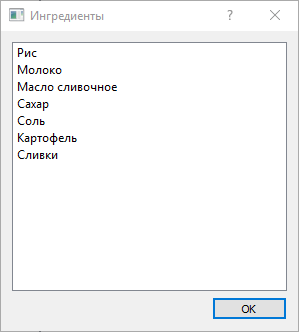

Книга рецептов
=============

Содержание:
-----------
1. Главное окно
2. Добавление рецептов
3. Редактирование рецептов
4. Просмотр ингредиентов

Главное окно
------------
Основное окно программы состоит из панели меню (сверху) и двух списков:

* Список категорий (слева)
* Список блюд (справа)

Добавление рецептов
-------------------
Для того, чтобы добавить новый рецепт, нажмине на кнопку "Добавить рецепт" на панели меню. Появится следующее окно:

Редактирование рецептов
-----------------------
Для редактирования рецепта дважды щёлкните на нужное блюдо в списке рецептов. Появится следующее окно:

Просмотр ингредиентов
---------------------
Для просмотрв всех ингредиентов надмите на кнопку "Просмотреть ингредиенты" на панели меню. Появится следующее окно:

